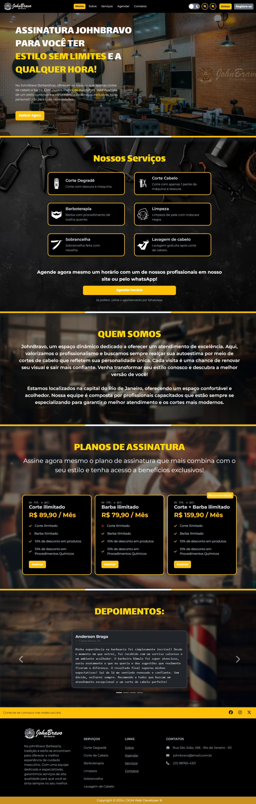
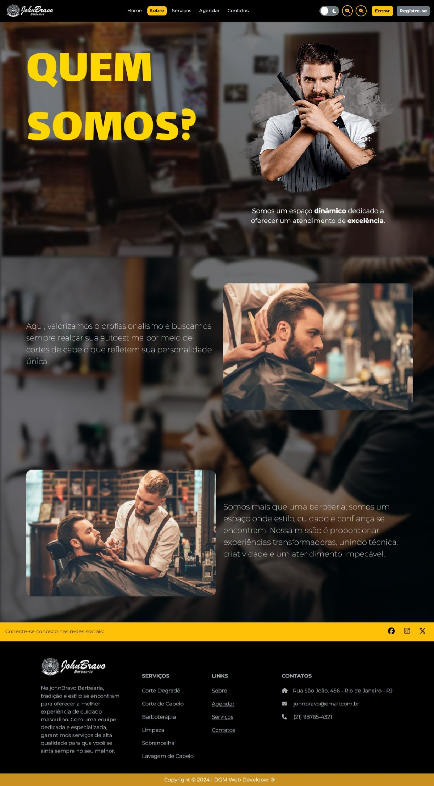
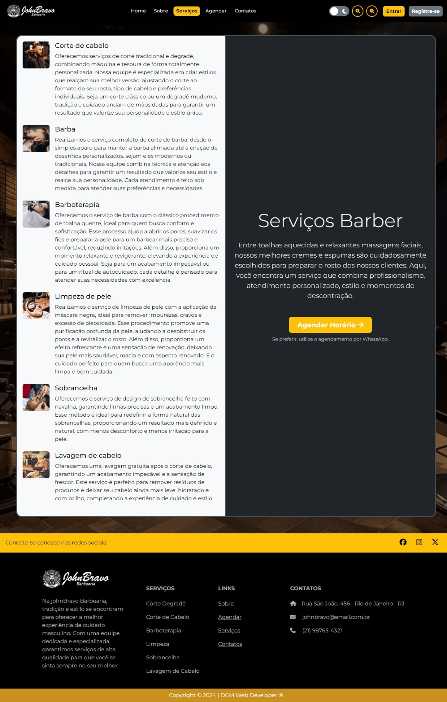
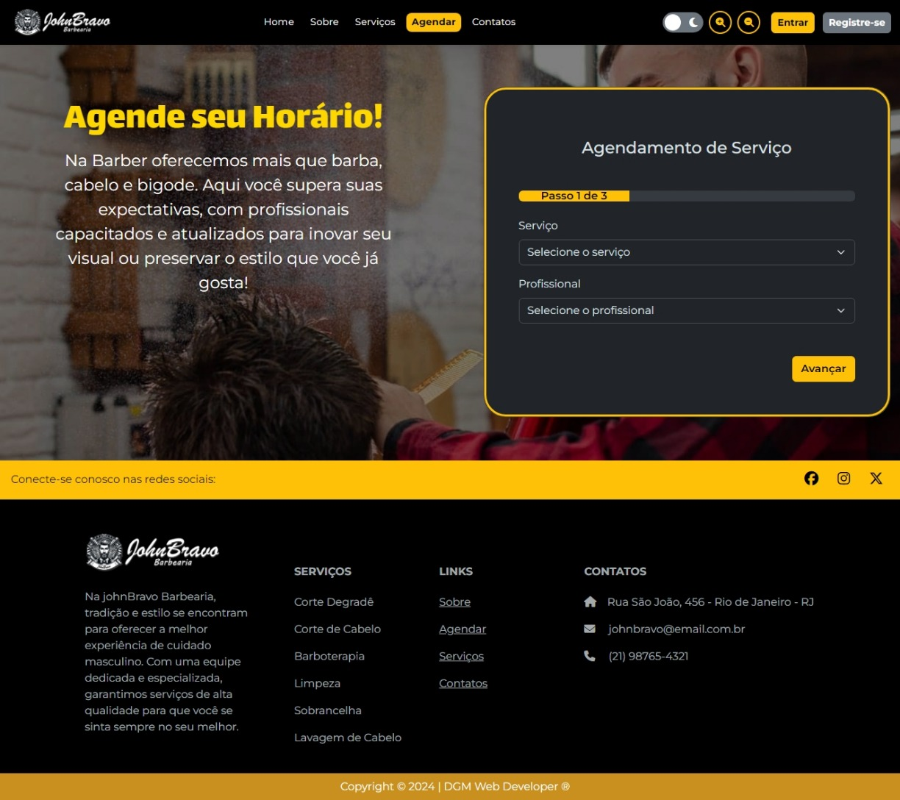
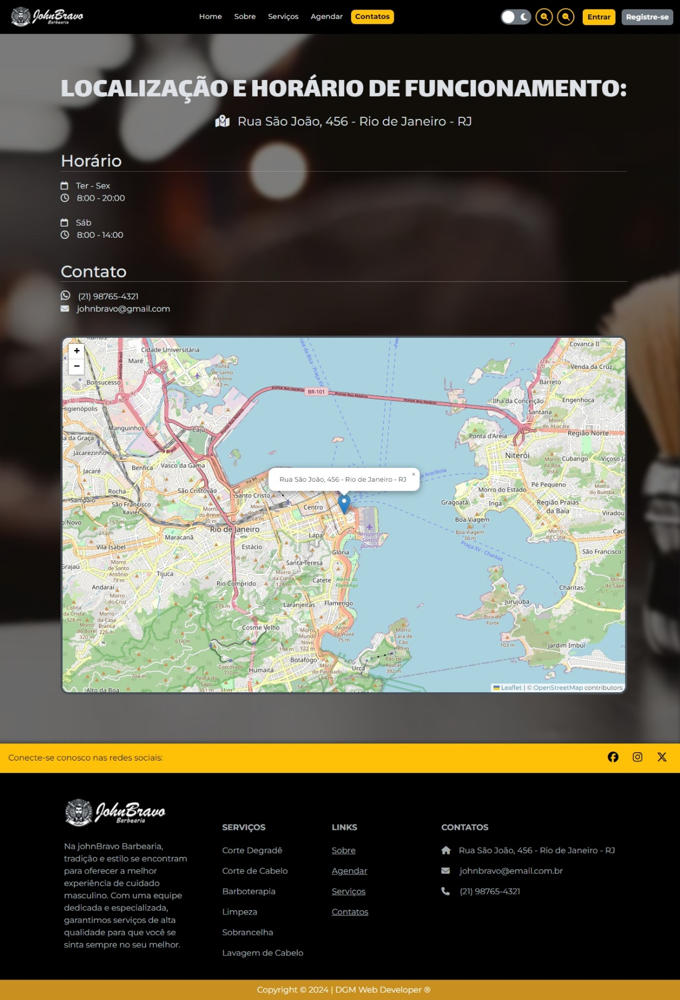
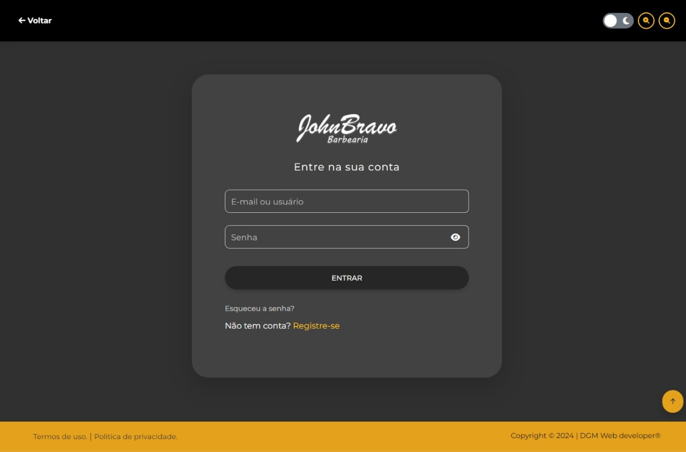
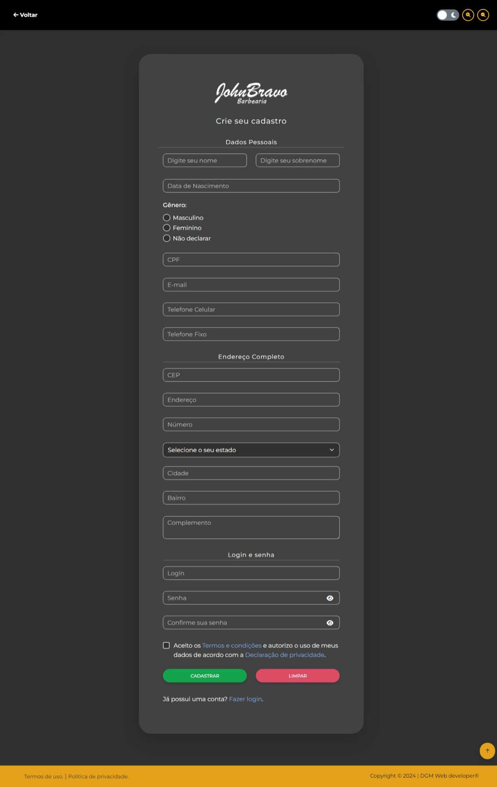

# DGM Projetos

Repositório de projetos do grupo DGM Unisuam 2024.2

    Status: Finalizado

----------------------------------------------

# Projeto UNISUAM do Site "JahnBravo Barbearia"

### --= Analise e desenvolvimento de sistemas =--

----------------------------------------------
**JohnBravo - Unisuam - Grupo 03 (DGM Web developer)**

*Integrantes:*

- **Daniel Vieira Ferreira;**
- **Geilson Machado Nascimento;**
- **Matheus Azevedo Ferreira;**
- **Ana Kelli da Silva Pereira;**

---

#### Turma: ADS0101M

----------------------------------------------

## Projeto finalizado em *23/11/2024 - 23:23*

----------------------------------------------

Bem-vindo ao projeto do site JonBravo Barbearia desenvolvido pelo grupo DGM Web Developer (Grupo 03) como parte do programa da Universidade Unisuam no curso de Análise e Desenvolvimento de Sistemas. Este projeto foi criado para demonstrar as habilidades e conhecimentos adquiridos em HTML, CSS, JavaScript e frameworks.

## Objetivo

O objetivo principal do projeto é construir a parte do Front-End de um site que fosse funcional e responsivo e que tivesse identidade própria e personalizada e com serviços exclusivos, oferecendo uma experiência agradável aos usuários. Foram implementadas as seguintes funcionalidades:

- Página de Cadastro: Uma página intuitiva e fácil de usar, com campos de preenchimento obrigatório, validação de formato, limites de caracteres e feedback visual ao usuário.

- Página de Login: Uma interface segura e amigável que permite aos usuários fazer login de forma rápida e eficiente. Além disso, oferecemos a opção de recuperação de senha para fornecer suporte adicional aos usuários em caso de esquecimento de suas credenciais.

- Tela Principal: A página principal do site, projetada para impressionar os visitantes com um layout moderno e atraente. Além disso, incluímos um recurso de modo escuro para uma experiência de visualização personalizada e a opção de tamanho de texto onde o usuário pode aumentar ou diminuir o texto conforme o desejado para a melhor visualização do conteúdo do site.

- Design Moderno: Foi dado destaque a um design moderno e estilizado, com uma identidade visual única e exclusiva. Utilizamos elementos visuais atraentes, cores harmoniosas e layout responsivo para garantir uma experiência de usuário agradável em diferentes dispositivos.

## Tecnologias Utilizadas

- HTML5: Utilizado para a estruturação e marcação das páginas.

- CSS3: Utilizado para a estilização e layout do site, garantindo uma aparência visualmente atraente.

- JavaScript: Utilizado para adicionar interatividade e funcionalidades dinâmicas ao site como o SPA (Single Page Application) para carregar as páginas do site dinamicamente deixando o site mais fluído e rápido.

- Frameworks (Bootstrap e MDB): Utilizado para acelerar o desenvolvimento e fornece recursos adicionais ao projeto.

- Bibliotecas: Foram usadas bibliotecas como a Font Awesome (biblioteca de ícones)<!--,  jQuery (biblioteca JavaScript) e iziToast (biblioteca JavaScript para notificações). -->
Essas bibliotecas foram incorporadas ao projeto para fornecer recursos adicionais e facilitar o desenvolvimento de determinadas funcionalidades, como manipulação do DOM, interação com o usuário e exibição de notificações.

<!-- ## Resultados Alcançados

O projeto foi concluído com sucesso, atendendo a todos os requisitos e funcionalidades solicitadas. Com a aplicação dos conhecimentos adquiridos, conseguimos criar um site profissional, funcional e esteticamente agradável. O site oferece uma experiência envolvente aos usuários, destacando a marca Telecall e demonstrando nosso domínio das tecnologias web. -->

## Licença

Este projeto está licenciado para uso exclusivo pelo grupo DGM Web Developers (Grupo 03). Para mais informações, consulte o arquivo [LICENSE](./LICENSE).

Agradecemos a você por explorar nosso projeto e esperamos que ele possa servir de inspiração e aprendizado para outros desenvolvedores. Estamos ansiosos para apresentar o resultado do nosso trabalho e esperamos que ele atenda às expectativas dos usuários do site e docentes responsáveis.

---

## Demo

### Imagens do projeto

##### Tela inicial

##### Página Sobre

##### Página Serviços

##### Página Agendar

##### Página Contatos

##### Página de Login

##### Página de Cadastro

****

### **Teste o site clicando [aqui](https://johnbravo-dgm.web.app).**
